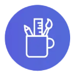

# Adobe [!DNL GenStudio] Tutorials

<!-- 
 
-->

>[!BEGINSHADEBOX]

Adobe [!DNL GenStudio] är den enda totallösningen som snabbar upp företagets innehållsleveranskedja genom att ge teamet möjlighet att skala innehållsskapandet med generativ AI, öka teamets flexibilitet och snabbhet till marknaden och förbättra avkastningen och effektiviteten.

>[!VIDEO](https://video.tv.adobe.com/v/3424114?quality=12&learn=on)

En innehållsleverantörskedja för samman människor, verktyg och arbetsflöden för att effektivt planera, skapa, producera, leverera och mäta innehåll. Med kunder som kräver upplevelser av högre kvalitet i allt högre takt, i kombination med komplexiteten hos flera kanaler och format, måste varumärkena revolutionera sitt sätt att tänka på innehåll.

>[!ENDSHADEBOX]

<table>
    <tr style="border: 0;">
      <td>
        
        

        <a href="https://experienceleague.adobe.com/docs/genstudio-learn/tutorials/workflow-and-planning.html">
        <strong>Arbetsflöde och planering</strong>
        </a>
        

        

        <em>Effektivisera och samordna arbetet</em>
        

      </td>
      <td>
        
        

        <a href="https://experienceleague.adobe.com/docs/genstudio-learn/tutorials/creative-productivity.html">
        <strong>Kreativ produktivitet</strong>
        </a>
        

        

        <em>Övertygande kreativa team</em>
        

      </td>
    </tr>
    <tr style="border: 0;">
      <td>
        
        

        <a href="https://experienceleague.adobe.com/docs/genstudio-learn/tutorials/marketing-agility.html">
        <strong>Marknadsföringsflexibilitet</strong>
        </a>
        

        

        <em>Ge marknadsförare och andra team möjlighet att snabbt få ut innehåll på marknaden</em>
        

      </td>
      <td>
        
        

        <a href="https://experienceleague.adobe.com/docs/genstudio-learn/tutorials/delivery-and-activation.html">
        <strong>Leverans och aktivering</strong>
        </a>
        

        

        <em>Aktivera leverans och prestanda</em>
        

      </td>
    </tr>
</table>

## Ytterligare resurser

* [Experience League Events](https://experienceleague.adobe.com/events/)
* [Adobe [!DNL GenStudio] på business.adobe.com](https://business.adobe.com/solutions/adobe-genstudio.html)
* [Adobe [!DNL GenStudio] resursguide](https://business.adobe.com/resources/sdk/getting-started-with-adobe-genstudio.html)
* [Adobe i innehållsförsörjningskedjan](https://business.adobe.com/resources/webinars/adobe-on-the-content-supply-chain.html)
